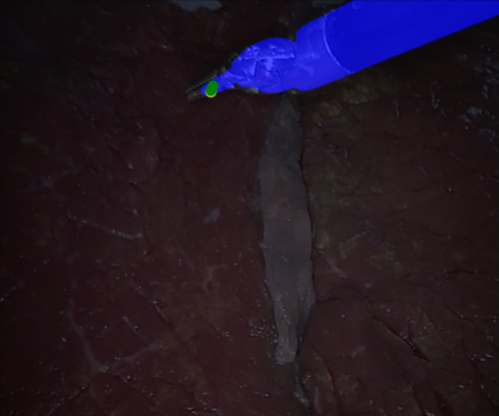
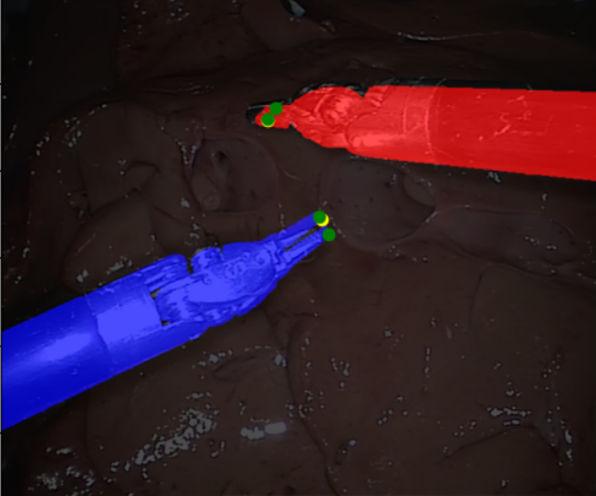
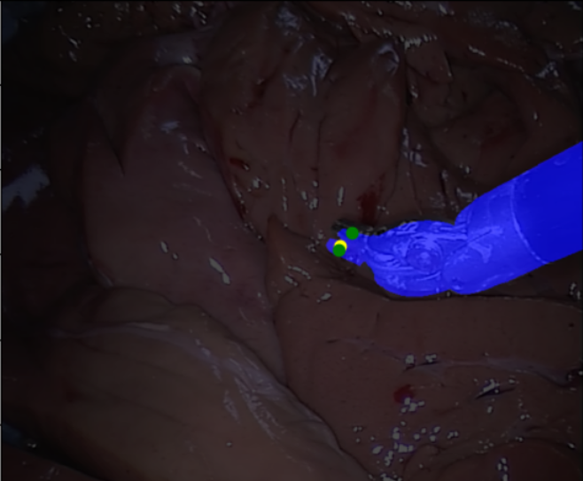

# Improved Instance Segmentation-based Algorithm for Surgical Instrument Tip Detection
**[15.07.2024]** Paper submitted to [ICTA 2024](https://icta.hvu.edu.vn/). 

In this paper, we propose an algorithm based on segmentation masks to identify the tip point of a surgical instrument. We tested it on the Endovis 15 Dataset, achieving an accuracy of up to 87%.  

## Test
First, clone our repository:
```bash
git clone https://github.com/ihbkaiser/TrackingToolTipsLab.git
```
Next, download our data and trained YOLOv9 models [here](https://drive.google.com/drive/folders/1Z4_0maMJJLh1L1aYqa0nqFyKHb5ce_kB?usp=sharing), then organize the folder structure as shown below
```
TrackingToolTipsLab/
├── assets/
├── data/
│   └── endovis15/
├── src/
│   ├── Models/
│   │   ├── yolo_weights/
│   │   │   ├── yolov9e-best.pt
│   │   │   └── yolov9c-best.pt
│   │   └── ...
│   └── ...
├── README.md
└── requirements.txt
```
Next, set up a virtual environment and execute the following commands to see the algorithm being evaluated.

```
cd TrackingToolTipsLab
python -m venv myenv
myenv\Scripts\activate
pip install -r requirements.txt
cd src
python Eval.py
```
## Demo
The yellow points are the tool tips detected by our algorithm, and the green points are the ground truth tips.
<p align="center">
  
  
  
</p>

We have uploaded a video to visualize our algorithm. You can view them [here](https://www.youtube.com/watch?v=RViEv6ap-dI).

